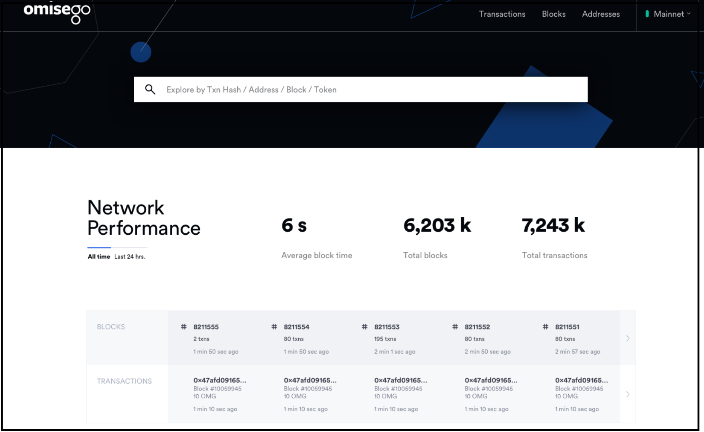

## Browse the OmiseGO Network Block Explorer
This procedure launches the online block explorer for the OmiseGO Network, selects the network (either Mainnet or Testnet), and explains how you can search for data. 

**Perform these steps**:

1. Go to the online block explorer at http://quest.samrong.omg.network/.

2. Choose to view or skip the tutorial that shows you how the Plasma child chain works, and how to use a mobile wallet.
 	
	***Note**: The latest version of the block explorer ships with a mobile wallet and a tutorial to help you get started transacting on the network. You can use OmiseGO's mobile wallet, or import and sync an existing wallet that you own.*

3. On the navigation var, select the network you wish to explore, either Mainnet, or Testnet. 

4. Enter criteria in the search bar to locate specific blocks, transactions, orders, assets, or addresses: 
   * Search by address, token, block number, or transaction hash.
   * View your transactions and balances
   * View UTXOs with exits in progress
   * View the number of exits currently in the exit queue
   * View exits that have completed processing, which means they're no longer UTXOs in the system
	

## Verify Network Availability and Performance Statistics
This procedure displays network availability and performance statistics.

***Note**: Statistics for block and transaction data indicate the blockchain's hash rate and transaction growth, which defines whether mining difficulty is increasing or decreasing.*

**Perform these steps**:
1. Go to the online block explorer at http://quest.samrong.omg.network/.

2. Select the network.

3. To check network health and status, note the color indicator adjacent to the network name:

     

 - Green: child chain available
 - Amber: child chain is problematic; byzantine events exist
 - Red: child chain unavailable
 
4. To check network performance statistics, select a time period beneath header **Network Performance**; either **All time** or **24 hrs**.
   
   The table describes network performance statistics available on the main page of the block explorer:
 
| Field   | Description   | 
| ---    |  ---  | 
| Average block time  |  Average time, in seconds, it takes to generate the next block in the chain, either 'All time', or in the 'Last 24 hrs', depending on the option selected at Network Performance. Transaction volume and speed on the network increases as average block time decreases.  |
| Total blocks  |  Total number of blocks mined, either 'All time', or in the last 'Last 24 hrs', depending on the option selected at **Network Performance**.  |
| Total transactions  |  Total number of transactions processed, either 'All time', or 'Last 24 hrs', depending on the option selected at **Network Performance**.  |
| BLOCKS  |  Live feed of recently mined blocks on the blockchain. New blocks are listed as soon as they're discovered. Click on a block to view its details, such as the cryptographic hash of the previous block, a timestamp, and the number of transactions in the block.  | 
| TRANSACTIONS  | Live feed of recen, successfuls transactions on the blockchain, including data for individual transactions, such as the unique identifier, or hash, of the Plasma child chain transaction.  |

